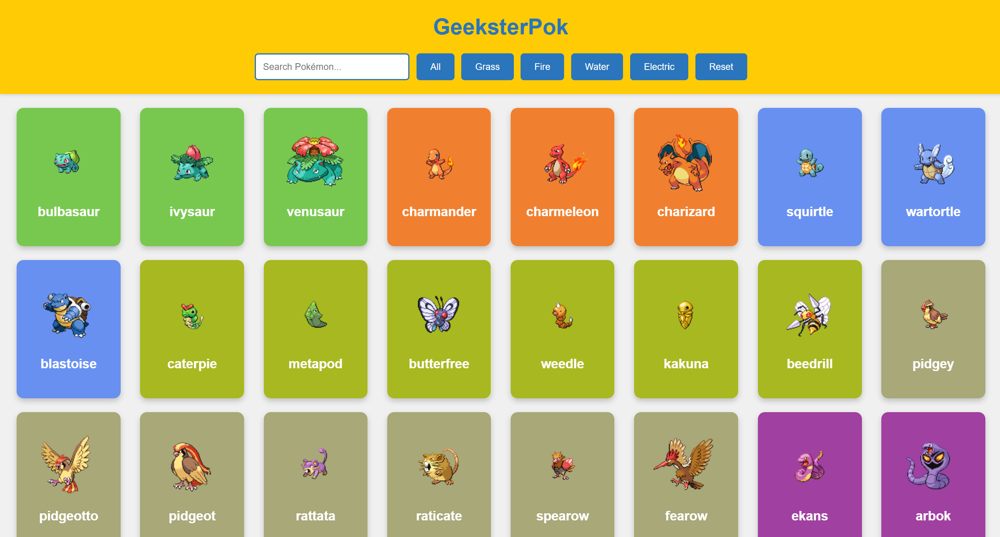

# GeeksterMon

GeeksterPok is a simple web application that displays a list of Pokémon. You can filter Pokémon by type, search for specific Pokémon by name, and reset the filters to view all Pokémon. Each Pokémon card flips on hover to reveal additional details like types and abilities.

## Features

- **Display Pokémon**: Fetches and displays a list of Pokémon with their images, names, types, and abilities.
- **Filter by Type**: Filter Pokémon by their type (e.g., Grass, Fire, Water, Electric).
- **Search Pokémon**: Search for Pokémon by name.
- **Reset Filters**: Reset all filters and display all Pokémon.
- **Flip Cards**: Hover over a Pokémon card to flip it and see more details.

## Technologies Used

- **HTML**: For the structure of the web page.
- **CSS**: For styling and animations (e.g., flip cards).
- **JavaScript**: For fetching Pokémon data and handling user interactions.
- **PokeAPI**: For fetching Pokémon data.

## How to Use

1. Open the `index.html` file in your browser.
2. Use the filter buttons to view Pokémon of a specific type.
3. Use the search bar to search for Pokémon by name.
4. Click the "Reset" button to clear all filters and display all Pokémon.
5. Hover over a Pokémon card to flip it and see more details.

## Project Structure

- `index.html`: The main HTML file.
- `style.css`: The CSS file for styling the application.
- `script.js`: The JavaScript file for fetching data and handling logic.

## Screenshots

 

Feel free to contribute or suggest improvements!
